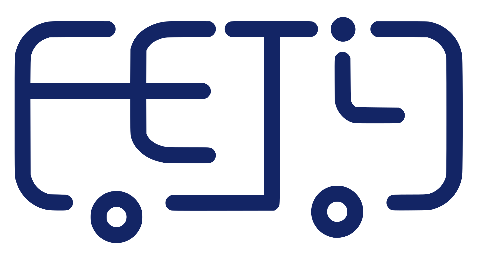

# FETI - Fiscalizador Eletrônico Inteligente para Transportes Públicos



## Sobre o Projeto

O FETI é um sistema integrado de Internet das Coisas (IoT), composto por dispositivos inteligentes, dashboards analíticos e um aplicativo web, desenvolvido para monitorar e otimizar a experiência em transportes públicos. 

O projeto aborda questões como:
- Superlotação
- Desconforto térmico
- Falta de planejamento em rotas

Ele une tecnologias de IoT e desenvolvimento web para melhorar a qualidade dos serviços oferecidos a passageiros e empresas de transporte público.

## Integrantes do Grupo
- Igor Gomes Vieira
- Joseph Patrick R. A. Trupel

## Links e Arquivos

### Arquivos do Repositório

- **Roteiro de Extensão**: [public/roteiro_extensao.pdf](public/roteiro_extensao.pdf)
- **Apresentação em PDF**: [public/apresentacao.pdf](public/apresentacao.pdf)
- **Apresentação em Vídeo**: [public/apresentacao_video.mp4](public/apresentacao_video.mp4)  

### Links Externos

- **Dashboard Público**: [Acessar o Dashboard no Beebotte](https://beebotte.com/dash/08b66b10-9e36-11ef-9187-737958943ad4?shareid=shareid_caECyPJoSIe6hLtb)
- **Projeto Wokwi**: [Acessar o Projeto no Wokwi](https://wokwi.com/projects/413996323601280001)
- **Repositório do Código IoT no GitHub**: [./wokwi no GitHub](https://github.com/josephpatrick1/feti/tree/main/wokwi)
- **Demo do App** (a ser definido): [Aplicativo FETI](https://feti.vercel.app/)


## Como Iniciar o Projeto Nuxt

1. Instale as dependências:
   ```bash
   yarn install
   ```
2. Inicie o servidor de desenvolvimento:
   ```bash
   yarn dev
   ```

---

## Estrutura do Projeto

### 1. **Dispositivo IoT**
Desenvolvido em MicroPython, é composto por sensores e atuadores para monitorar temperatura, lotação e localização de veículos em tempo real. O código está disponível na pasta `wokwi`.
[**Acessar Projeto Wokwi**](https://wokwi.com/projects/413996323601280001)


**Componentes principais:**
- ESP32 com WiFi
- Sensor de Temperatura e Umidade (DHT22)
- Módulo GPS (U-blox NEO-6M)
- Sensores de movimento (PIR)
- Display LCD (I2C)

### 2. **Dashboard Inteligente**
Visualize dados em tempo real por meio de um painel analítico na plataforma Beebotte:
[**Acessar Dashboard**](https://beebotte.com/dash/08b66b10-9e36-11ef-9187-737958943ad4?shareid=shareid_caECyPJoSIe6hLtb)

Este painel permite acompanhar métricas essenciais, como temperatura, lotação e rotas, facilitando a tomada de decisões rápidas e a otimização de recursos.

### 3. **Aplicativo Web**
Desenvolvido com Nuxt, o aplicativo é dividido entre o servidor (`./server`) e o frontend. Ele permite que passageiros e operadores:
- Acompanhem a localização dos veículos.
- Verifiquem informações sobre temperatura e ocupação.
- Planejem viagens com maior comodidade.
[**Acessar Visualização do APP**](https://beebotte.com/dash/08b66b10-9e36-11ef-9187-737958943ad4?shareid=shareid_caECyPJoSIe6hLtb)


#### Funcionalidades principais:
- Integração com Beebotte via API.
- Simulação de rotas baseada em dados reais.

### 4. **Vídeo de Apresentação**
Veja o conceito completo do projeto no vídeo de apresentação disponível na pasta:
`videos/apresentacao.mp4`

---

## Etapas do Desenvolvimento

1. **Planejamento Inicial:**
   - Diagnóstico de problemas em transportes públicos, incluindo desconforto térmico e superlotação.

2. **Desenvolvimento do Dispositivo IoT:**
   - Montagem dos circuitos e programação em MicroPython para integração com sensores.

3. **Integração com Beebotte:**
   - Configuração de canais para monitoramento de dados em tempo real.

4. **Criação do Dashboard:**
   - Configuração de gráficos e métricas visuais no Beebotte para facilitar a análise dos dados coletados.

5. **Desenvolvimento do Aplicativo:**
   - Interface intuitiva que conecta usuários ao sistema de monitoramento.

6. **Testes e Validação:**
   - Simulação de viagens com base em dados reais e ajustes finais.

---

## Benefícios do Sistema

- **Para passageiros:** Dados acessíveis em tempo real sobre lotação e temperatura, proporcionando viagens mais confortáveis.
- **Para operadores:** Informações detalhadas para otimizar rotas e reduzir custos operacionais.
- **Para órgãos públicos:** Ferramentas para monitorar e fiscalizar a qualidade do transporte público.

---

## Recursos Adicionais
Para informações mais detalhadas sobre as etapas, consulte o **Roteiro de Extensão** incluso nos arquivos do projeto.

---

Se tiver dúvidas ou sugestões, entre em contato com a equipe de desenvolvimento. Contribua com a melhoria do transporte público através da tecnologia!